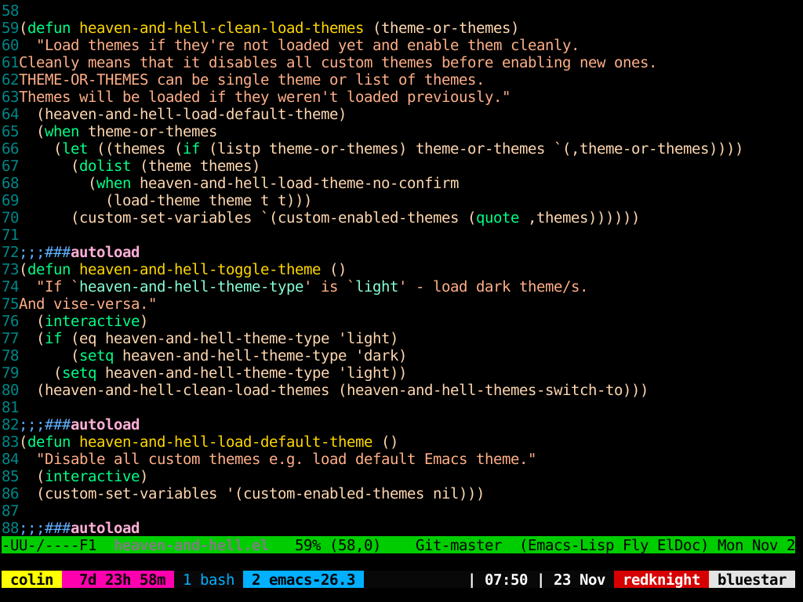
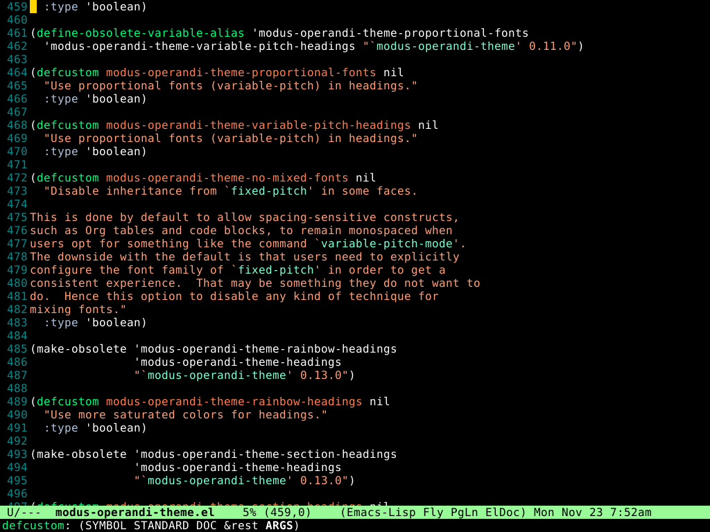

# Table of Contents

1.  [What is it?](#org02bcb5d)
2.  [Installation](#org11acde2)
3.  [Modifications](#org321c9c3)
4.  [Screen Shots](#org205636d)
    1.  [Emacs in an xterm with tmux](#orgfaa4498)
    2.  [Emacs as a GUI](#orgf8f5eae)

# What is it?

A really simple color theme for emacs.

# Installation

The simplest way to install is to download the file
`simple-dark-theme.el` and put it in your custom theme directory. The
default value of the custom theme directory is `~/.emacs.d/themes`.
This can changed this by adding the lines

    (setq custom-theme-directory "~/path/to/personal/themes/directory")

to your emacs init file (usually `~/.emacs`). To load the theme, add
the lines

    (load-theme 'simple-dark t t)
    (enable-theme 'simple-dark)

to your emacs init file. You can also do `M-x load-theme` and press
TAB to show a list of available themes to select. The process can be
reversed by doing `M-x disable-theme`.

If you have a `custom-set-faces` in your emacs-init file then you may
find the colors have changed. If this is not what you want then either
delete or comment out `custom-set-faces`.

# Modifications

A `simple-light-theme` can be created by just changing the line

    '(default ((t (:foreground "white" :background "black" :weight normal))))

in `simple-dark-theme.el` to `:foreground "black"` and `:background
"white"`.

You can then use something like
<https://github.com/valignatev/heaven-and-hell> to toggle between simple
dark and simple light themes.

# Screen Shots

## Emacs in an xterm with tmux

## Emacs as a GUI

